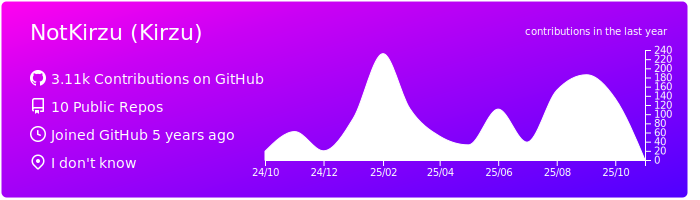
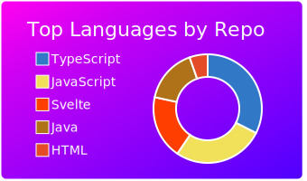
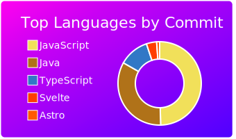

## default

[](https://github.com/NotKirzu/NotKirzu)
[](https://github.com/NotKirzu/NotKirzu) [](https://github.com/NotKirzu/NotKirzu)
[](https://github.com/NotKirzu/NotKirzu) [](https://github.com/NotKirzu/NotKirzu)
### Now you can add this to your markdown
```

[](https://github.com/NotKirzu/NotKirzu)
[](https://github.com/NotKirzu/NotKirzu) [](https://github.com/NotKirzu/NotKirzu)
[](https://github.com/NotKirzu/NotKirzu) [](https://github.com/NotKirzu/NotKirzu)

```

### Each card usage
---


```

```

    

---


```

```

    

---


```

```

    
